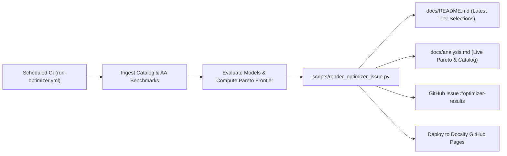

# OpenCode Go Model Optimizer — Latest Tier Selections

This file is populated in CI by `scripts/render_optimizer_issue.py` during the scheduled optimizer workflow run.

```mermaid
flowchart LR
    CI["Scheduled CI (run-optimizer.yml)"] --> FETCH["Ingest Catalog & AA Benchmarks"]
    FETCH --> OPT["Evaluate Models & Compute Pareto Frontier"]
    OPT --> RENDER["scripts/render_optimizer_issue.py"]
    RENDER --> TIERS["docs/README.md (Latest Tier Selections)"]
    RENDER --> CHARTS["docs/analysis.md (Live Pareto & Catalog)"]
    RENDER --> ISSUE["GitHub Issue #optimizer-results"]
    RENDER --> PAGES["Deploy to Docsify GitHub Pages"]
```
