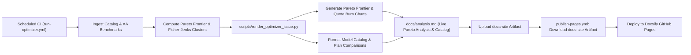

# OpenCode Go Model Optimizer — Live Pareto Analysis & Catalog

This file is populated dynamically in CI by `scripts/render_optimizer_issue.py` during each optimizer run.

```mermaid
flowchart LR
    CI["Scheduled CI (run-optimizer.yml)"] --> FETCH["Ingest Catalog & AA Benchmarks"]
    FETCH --> OPT["Compute Pareto Frontier & Fisher-Jenks Clusters"]
    OPT --> RENDER["scripts/render_optimizer_issue.py"]
    RENDER --> CHARTS["Generate Pareto Frontier & Quota Burn Charts"]
    RENDER --> CATALOG["Format Model Catalog & Plan Comparisons"]
    CHARTS --> ANALYSIS["docs/analysis.md (Live Pareto Analysis & Catalog)"]
    CATALOG --> ANALYSIS
    ANALYSIS --> ARTIFACT["Upload docs-site Artifact"]
    ARTIFACT --> DOWNLOAD["publish-pages.yml: Download docs-site Artifact"]
    DOWNLOAD --> PAGES["Deploy to Docsify GitHub Pages"]
```
