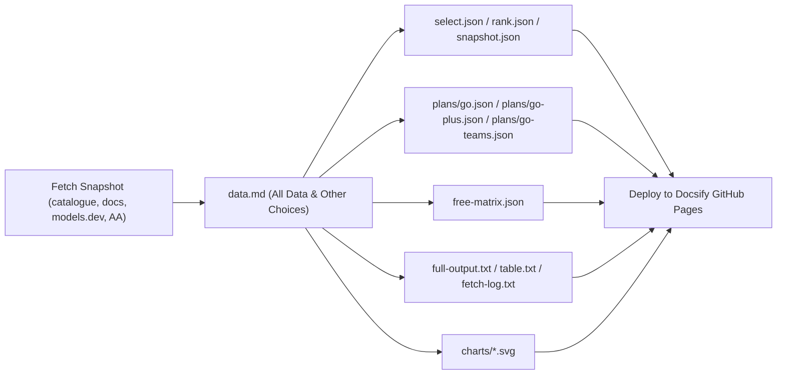

# OpenCode Go Model Optimizer — All Data & Other Choices

This file is populated in CI by `scripts/render_optimizer_issue.py` during each optimizer run.

```mermaid
flowchart LR
    FETCH["Fetch Snapshot (catalogue, docs, models.dev, AA)"] --> DATA["data.md (All Data & Other Choices)"]
    DATA --> RAW["select.json / rank.json / snapshot.json"]
    DATA --> PLANS["plans/go.json / plans/go-plus.json / plans/go-teams.json"]
    DATA --> FREE["free-matrix.json"]
    DATA --> OUTPUT["full-output.txt / table.txt / fetch-log.txt"]
    DATA --> CHARTS["charts/*.svg"]
    RAW --> PAGES["Deploy to Docsify GitHub Pages"]
    PLANS --> PAGES
    FREE --> PAGES
    OUTPUT --> PAGES
    CHARTS --> PAGES
```
